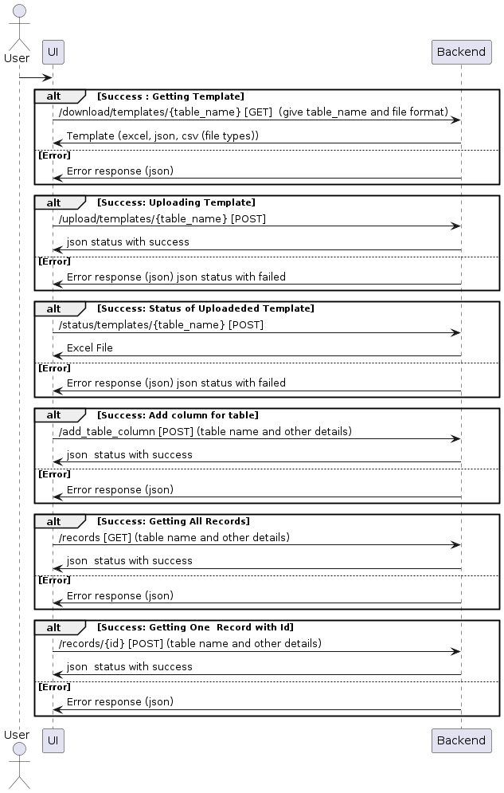
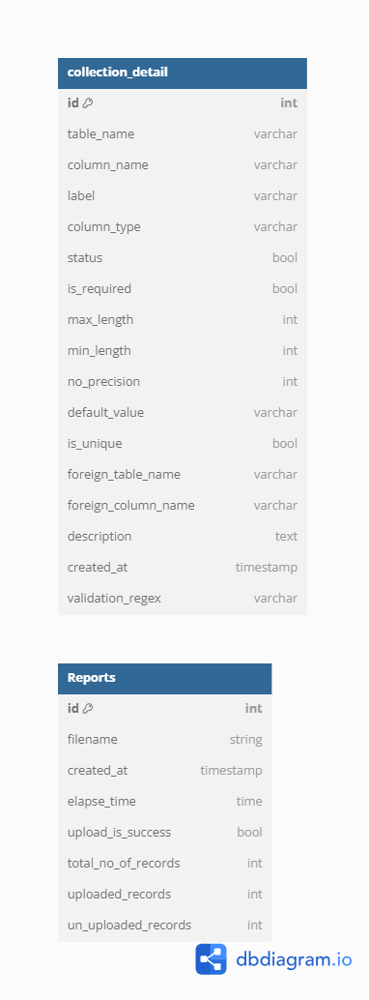

# Project Title

## 1. Environment Setup

### Prerequisites
- List any software, libraries, or tools required for the project.

### Installation
1. Clone the repository:
    ```sh
    git clone https://github.com/Rameshkumar-V/TEMPLATES.git
    ```
2. Navigate to the project directory:
    ```sh
    cd TEMPLATES
    ```
3. Follow the specific setup instructions (e.g., setting up a virtual environment, installing dependencies):
    ```sh
    # Example for Python projects
    python -m venv venv
    source venv/bin/activate   # On Windows use `venv\Scripts\activate`
    pip install -r requirements.txt
    ```

## 2. UML Diagram

The UML diagrams can be found in the `diagrams` directory.

### Diagram


## 3. DB Diagram

The database diagrams can be found in the `diagrams` directory.

### Diagram


## Additional Sections
- Add any additional information or sections that are relevant to your project.
